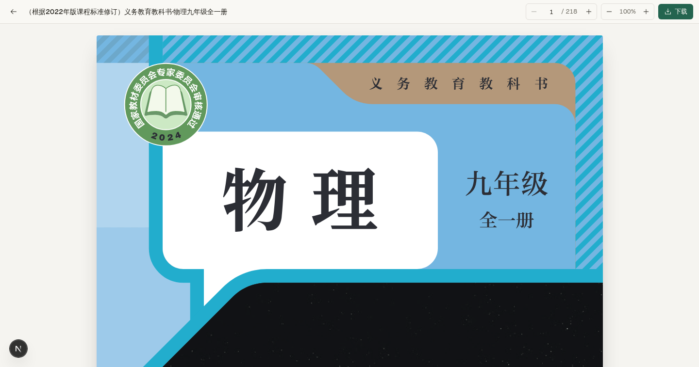
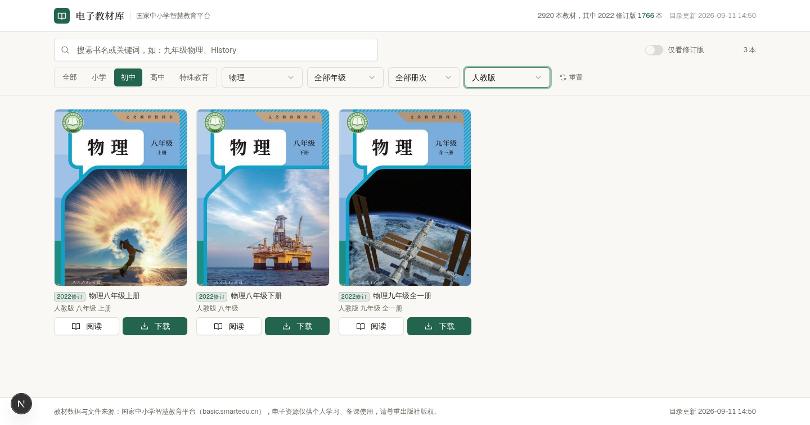
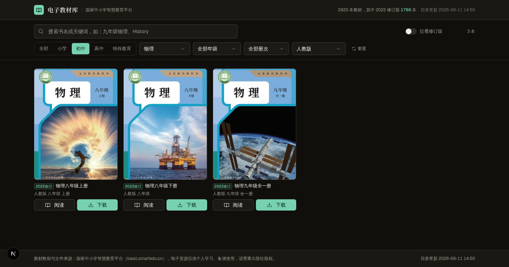

# 中小学电子教材库 · textbooks

> 一个自托管的中小学电子课本站点：检索、预览、下载国家中小学智慧教育平台的全部电子教材，完整支持 2022 年版课程标准修订版 —— 边下边看，看过的秒开。

**在线预览：<https://textbooks.space-z.ai>**

    

| 首页检索 | 流式预览 |
| --- | --- |
|  |  |
| **级联筛选** | **深色模式 / 移动端** |
|  |  |

## ✨ 特性

- **全量目录**：2920 本义务教育电子教材（含 2022 课标修订版 1766 本），与上游平台同源
- **精准检索**：全文搜索 + 学段 → 学科/年级 → 册次 → 版本级联筛选（版本列表动态收敛到当前组合下真实存在的版别），一键只看修订版
- **双模式预览**：默认浏览器原生查看器（iframe 直出，保底可用）；一键切换 pdf.js 流式阅读器（渐进加载进度、页码跳转、缩放、键盘翻页、内置中文 CMap）
- **下载提速**：6 并发 × 4MB 分块 + r1/r2/r3 三镜像轮换 + Content-Range 双重校验，实测 5.7 → 12.6 MB/s（约 2.2 倍）
- **三级降级**：磁盘 LRU 缓存命中（毫秒级，实测 147 MB/s）→ 并行分块管线 → 单流透传；上游故障最多 12 秒后降级，永不永久挂起
- **封面缓存**：2600 张封面压缩落盘 + immutable 浏览器缓存
- **月度自动更新**：纯 Node 实现目录全量更新（30 天到期 + 凌晨空闲窗口 + 超期补跑 + 失败退避），更新后自动清理 PDF 缓存、裁剪已下架教材的孤儿封面；原子写入 + 并发锁 + 半残数据防御
- **配套音频**：教材配套音频资源解析与代理播放
- **课本纸主题**：暖纸底 + 松墨绿单强调色、深色模式、移动端适配、reduced-motion 降级

## 🚀 快速开始

环境要求：[Bun](https://bun.sh) ≥ 1.1（Node ≥ 20 亦可）。

```bash
git clone https://github.com/aaaaaasi/textbooks.git
cd textbooks
bun install

bun run dev          # 开发模式 → http://localhost:3000

# 生产构建（standalone 产物约 27MB）
bun run build
bun run start        # 等价于 NODE_ENV=production node .next/standalone/server.js
```

仓库已内置全量目录（`data/catalog.json`）与已缓存封面（`data/covers/`），克隆后开箱即有完整检索体验；教材 PDF 不入库，首次预览/下载时自动从上游拉取并落盘缓存。

手动更新教材目录（平时由调度器每月自动执行）：

```bash
bun run update-catalog   # 等价于 bun src/lib/catalog-update.ts
```

## 🔌 API 一览

| 路由 | 说明 |
| --- | --- |
| `GET /api/catalog` | 全量目录（内存缓存 + mtime 失效，更新后无需重启） |
| `GET /api/book/[id]` | 教材详情 + 封面 + 配套音频 |
| `GET /api/download/[id]?inline=1` | PDF 代理下载/预览（支持 Range，三级降级，同时写缓存） |
| `GET /api/cover/[id]` | 封面（磁盘缓存 + immutable 浏览器缓存） |
| `GET /api/proxy?url=` | 上游 CDN 代理（白名单 `*.ykt.cbern.com.cn`，音频等资源） |

## ⚙️ 数据链路

上游接口与开源项目 [tchMaterial-parser](https://github.com/happycola233/tchMaterial-parser) 同源，均为国家中小学智慧教育平台公开接口：

1. 目录标签树 `…/zxx/ndrs/tags/tch_material_tag.json`（185 节点，BFS 展开为维度字典）
2. 全量目录版本 `…/tch_material/version/data_version.json` → 逗号分隔分片清单（4 片）
3. 详情 `…/ndrv2/resources/tch_material/details/{id}.json` → 取 `ti_items` 中 `ti_is_source_file=true` 的源文件路径
4. PDF 直链：`cs_path:${ref-path}` 前缀替换为 `https://r{1|2|3}-ndr.ykt.cbern.com.cn`，携带匿名占位鉴权头（`X-ND-AUTH: MAC id="0",nonce="0",mac="0"`）

## 🗄 缓存与月度自动更新

- `data/pdfs/`：PDF 磁盘 LRU 缓存（上限 3GB，按 mtime 淘汰，`.part` 临时文件单写入者会话），看过的书二次预览/下载毫秒级
- `data/covers/`：封面缓存；月度更新时自动裁剪新目录中已不存在的封面
- 调度策略（`src/lib/scheduler.ts`）：距上次**成功**更新超 30 天且本地 03:00–05:59 空闲窗口触发；超 34 天任意时段补跑；失败 24h 退避且不重置周期；进程内 promise + 跨进程文件锁双重防并发
- 更新安全（`src/lib/catalog-update.ts`）：原子写入（tmp + rename）、分片全部失败或书目骤减超半数时自动放弃并保留旧目录

## 📁 项目结构

```
src/app/            页面与 API 路由（首页、预览页 /preview/[id]，5 个 API）
src/lib/            smartedu 上游链路 / pdf-cache LRU 缓存 / catalog-update 月度更新 / scheduler 调度器
data/               catalog.json 全量目录 + covers/ 封面缓存（pdfs/ 运行时生成，不入库）
scripts/            Python 工具：build_catalog、smartedu_download、warm_covers、compress_covers、speed_test 等
public/cmaps/       pdf.js 中文 CMap（168 个 bcmap，中文教材渲染必需）
.zscripts/          部署脚本示例（bun install + build → 校验 standalone → 打包上传 + Caddy 反代）
```

## ☁️ 部署

任意能运行 Node ≥ 20 的环境均可：

```bash
bun run build
NODE_ENV=production node .next/standalone/server.js   # 默认 3000 端口，可用 PORT 覆盖
```

`.zscripts/build.sh` 为本站所在平台的一键部署脚本（构建 → standalone 校验 → 打包上传 → Caddy 反代 + 健康检查），可参考改造为自己的 CI/CD。

## 🔧 环境变量

| 变量 | 说明 |
| --- | --- |
| `DATABASE_URL` | 模板自带（SQLite 路径）。应用本身零数据库依赖，目录与缓存均落盘 `data/` |
| `PORT` | standalone 服务端口，默认 3000 |

## ⚠️ 数据来源与版权声明

- 教材目录、封面、PDF 均来自**国家中小学智慧教育平台**（basic.smartedu.cn）公开接口；本仓库不存储、不分发任何教材 PDF
- 教材版权归原作者与各出版单位所有，本项目仅供个人学习与教学研究使用，**请勿用于商业用途**
- 上游接口路径或鉴权策略变动可能导致功能失效，届时可关注 tchMaterial-parser 的最新适配
- `src/lib/deploy-probe.ts` 与 `.zscripts/build.sh` 内含部署调试探针（ntfy.sh 公共主题，仅发送时间戳/包体积/错误摘要），复刻时请自行更换或移除主题名

## 📄 License

[MIT](LICENSE)
